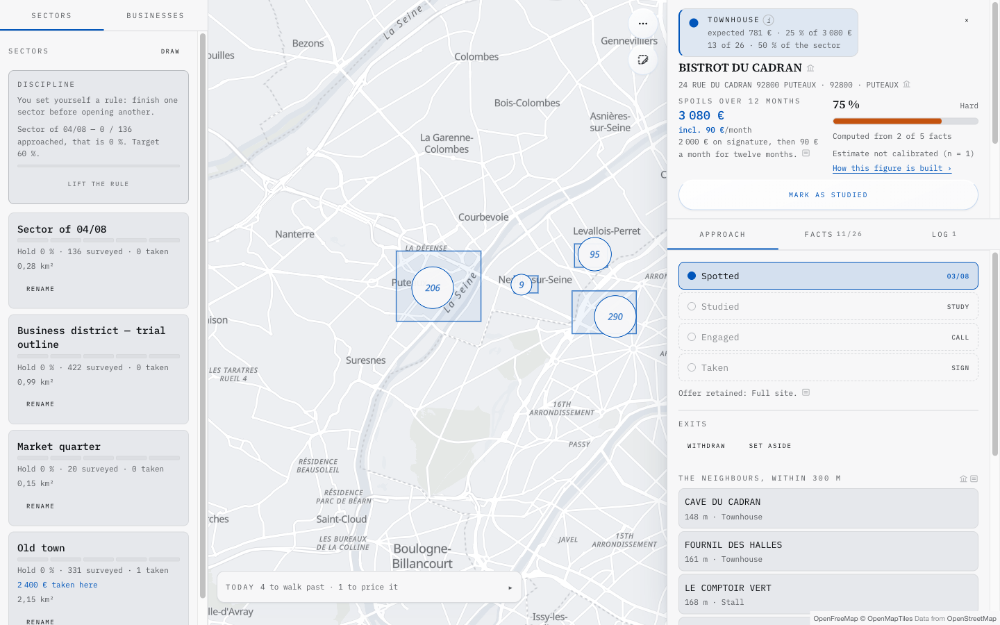

# Towncenter

**Neighbourhood-business prospecting, played as territory conquest.**

You draw a sector on a map. It fills with every business actually registered
there — the French national company register knows them, and it is free and
key-less. Each one becomes a **target** carrying two numbers: the **loot**, what
you would earn if it signed, and the **resistance**, what stands between you and
that signature. You approach, you engage, you take. Street by street.

The map is the product. Every number on it is backed by a measured fact: the
loot comes from a price grid you actually charge, the resistance from the state
of the website, the footfall and the ability to pay. Nothing climbs to look
busy.



<sub>Every business name, address and amount in that screenshot is fabricated.</sub>

Today it stops the moment a target signs. It is not meant to: the direction is
that a target you take becomes a **project**, and that the project holds its
documents. See [Scope, and where this is going](#scope-and-where-this-is-going)
— and note that none of that part is built yet.

---

## Stack

Next.js 16 (App Router, React 19, Server Components) · TypeScript · Postgres 16
with Drizzle ORM · MapLibre GL 5 with OpenFreeMap tiles · Tailwind 4. Node 22 or
later, Docker for the local database. No runtime beyond that.

---

## Quick start

```bash
git clone https://github.com/fberrez/towncenter.git
cd towncenter
npm install

cp .env.example .env.local     # then fill AUTH_SECRET
docker compose up -d           # Postgres on port 5455
npm run db:push                # apply the schema
npm run dev
```

Generate the session key with `openssl rand -base64 48` and paste it into
`AUTH_SECRET`. Below 32 characters the application refuses to start.

Open <http://localhost:3000>. **The first account you create owns the
instance**, and creating it closes signups — the pattern used by Miniflux,
Gitea, Vaultwarden and Plausible.

> [!WARNING]
> Between deployment and that first signup, **the instance is up for grabs**:
> whoever signs up first owns it. The guard is operational, not software. Sign
> up immediately, and only then point a public hostname at it. Never expose an
> instance that already holds data before you hold its first account.

---

## Environment variables

| Variable | Required | What it is |
|---|---|---|
| `AUTH_SECRET` | yes | Signs session tokens. 32 characters minimum. Changing it logs everyone out. |
| `DATABASE_URL` | yes | Postgres 14+. The value in `.env.example` matches the bundled `docker-compose.yml`. |
| `GOOGLE_PLACES_API_KEY` | for enrichment | Places API (New). Server-side only, never reaches the browser. Can also be entered on the Setup screen (per-account, wins over the environment). |
| `ALLOW_SIGNUPS` | no | Reopens signups once the first account exists. Absent: only the first signup is possible. |

Full descriptions are in [`.env.example`](.env.example). No secret is ever
copied into a tracked file.

---

## What needs a Google key, and what does not

| Source | Key | What it gives |
|---|---|---|
| `recherche-entreprises.api.gouv.fr` | no | SIREN, SIRET, trade name, address, coordinates, open establishments, incorporation date, headcount, revenue, directors |
| `data.geopf.fr` (IGN geocoder) | no | Address to point |
| Site audit (in-repo) | no | Stack, default theme, HTTPS, sitemap, online sales, booking, agency detected, Instagram used as a website |
| OpenFreeMap tiles | no | The map |
| **Google Places (New)** | **yes** | Rating, review count, price level, phone, opening hours |

Harvesting, scoring, the map, the game layer and the ledger are free and
key-less, and that does not change. **Only the two enrichment actions require
`GOOGLE_PLACES_API_KEY`**; without it they refuse to run and say what to do.

> [!IMPORTANT]
> **Do not expect a working key-less mode.** `targets.website_url` is written in
> exactly one place, from Google Places' `websiteUri` — neither the company
> register nor the geocoder returns a website. Without a key no business ever
> gets an address, so the in-repo site audit never has anything to audit. The
> application still boots, connects, shows the map, harvests a whole sector and
> computes every score, but enrichment stays at zero. Measured on a real
> 331-business frame: `0 enriched · 0 remaining · 772 with nothing to query`.
>
> Restoring a genuine key-less mode needs a free source of URLs first.
> OpenStreetMap via Overpass carries one for roughly 21 % of the shops in a
> frame — 103 sites out of 488, measured in Puteaux.

---

## The price grid is yours

Every amount on the map comes from **your** grid: the loot on a target, the
treasure of a sector, the rank of a business, the progress a deal is worth.

Open `/pricing` and change it. No score is stored — everything is recomputed on
read, so a change applies everywhere at once, with no migration and without
touching a single harvested row. Each account carries its own grid; on a shared
instance two salespeople never see each other's.

The grid that ships with the product is one freelancer's real rates. **It is a
starting point, not a recommendation.**

---

## What the data allows, and what it forbids

This tool reads a public register that contains real people. Three rules are
enforced in code and are not negotiable:

- **A non-diffusible establishment is never stored and never shown.** That is
  not an edge case, it is someone who exercised their right to object.
- **No personal contact details of directors are stored.** The name and the role
  are enough; you call the establishment's own line.
- **Google fields expire after 30 days.** Rating, reviews, opening hours and
  price level carry a fetch timestamp, are hidden past 30 days and then purged.
  Only `place_id` may be kept indefinitely. This is Google's terms of service,
  not a setting.

**Tile attribution is a licensing obligation, not decoration.** Never pass
`attributionControl: false`, and never lay a panel over it.

---

## Running the benches

```bash
npm run verify      # scoring, game, tenant isolation
npm run typecheck   # next typegen && tsc --noEmit
npm run build
```

`npm run verify` needs the database from `docker compose up -d` to be running.

| Bench | What it proves |
|---|---|
| `verify:scoring` | The algorithm lands on **five deals actually worked** — two signed, one refused, two deliberately off-grid — then on two orderings and eleven invariants. |
| `verify:game` | Rank follows expected value, taking a bigger business is worth more, the second tier lands exactly at the end of a first deal, and streaks count Europe/Paris days rather than UTC ones. |
| `verify:tenancy` | Every exported read returns only its owner's rows. **This is the only bench whose failure is a data leak.** |

An algorithm that does not land on those five deals is wrong, however elegant it
is — and it is the algorithm that gets fixed, never the bench.

---

## Deploying

Any Node 22 host with a Postgres database. `npm start` runs the migrations
before booting and exits on failure: a refused deployment beats a database in an
uncertain schema state.

---

## Scope, and where this is going

Today the product answers one question nothing else handled: **where do I start
this morning, and what is it worth.** Draw, harvest, score, approach, take. That
is what is built, that is what runs, and that is what you get if you install it
now.

**It will not stop there.** The direction is that a target you take becomes a
**project**, and that the project holds its documents — the quote, the mockup
you show the client, the deliverables. Finding the deal and delivering it are
the same job; splitting them across two tools means typing the same client
twice.

> [!NOTE]
> **None of that is built.** As of 2026-08-04 this repository has six tables —
> `users`, `targets`, `zones`, `events`, `price_grids`, `account_settings` — and stores **zero
> uploaded bytes**: no object storage, no blob column, no multipart handler.
> This section describes a direction, not a feature you can use.
>
> The rule that forbids a counter climbing without a fact behind it also forbids
> a README promising a screen that does not exist. This note comes out the day
> the screens go in, and not a commit earlier.

**It is still not a CRM**, and that is not going to change. No sales cycles, no
teams, no roles, no email sending from the tool, no importing a bought list. The
line is easy to hold: a quote attached to a project is a *document*; a
configurable pipeline with stages is a CRM.

**The map stays the product.** *If you can remove the map and the product still
works, it has failed* — that rule survives the widening. Projects are reached
**from** a target you took. They are not a parallel tab, and the day the map
becomes one view among several, this is a worse version of software that already
exists.

**A hosted instance is the longer-term ambition.** Self-hosting stays a
first-class path under AGPL, permanently — a hosted option would be for people
who do not want to run Postgres, never a way to make the free path worse. There
is no pricing, no billing and no plan today.

The product is **French by construction**. It reads the French company register,
geocodes with the French national geocoder, and formats amounts and dates in
`fr-FR` / `Europe/Paris`. Using it in another country means replacing the data
sources, not translating the strings. The interface itself is in English.

---

## Contributing

Read [`CONTRIBUTING.md`](CONTRIBUTING.md) before opening a pull request, and
[`ARCHITECTURE.md`](ARCHITECTURE.md) before changing code — it lists the
conventions that are invisible to `tsc` and to the build, and that have each
cost a real bug.

Security reports go through GitHub's
[private vulnerability reporting](https://github.com/fberrez/towncenter/security/advisories/new),
never through a public issue.

---

## Licence

[GNU AGPL v3](LICENSE). Self-host it, fork it, change it. If you run a modified
version as a network service, you have to publish your modifications.
